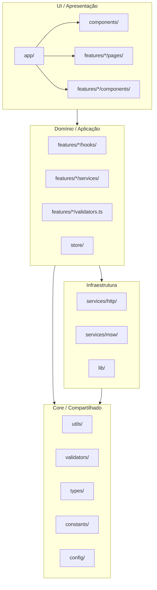
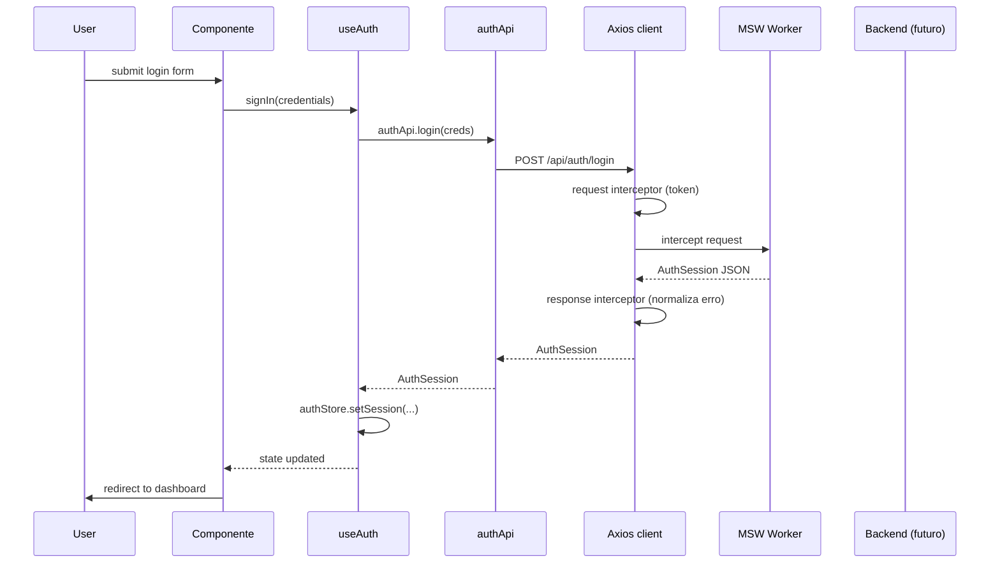
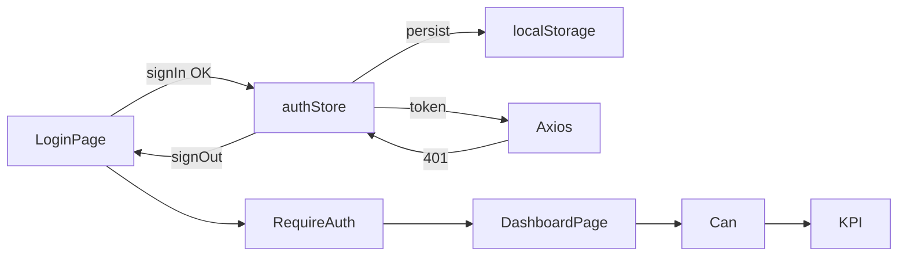

# Arquitetura

Este documento descreve a **Clean Architecture** aplicada à plataforma
Falcão Saúde Ocupacional, com **feature-first** dentro de `src/`.

## Princípios

- **Separação de responsabilidades** — cada camada tem um papel único e
  depende apenas de camadas mais internas.
- **Inversão de dependência** — features dependem de abstrações (services,
  validators), nunca de implementações concretas de UI.
- **Princípio da menor surpresa** — convenções claras: nomes consistentes
  (`<Feature>Page`, `use<Feature>`, `<feature>Api`), paths previsíveis.
- **Path alias `@/`** — imports absolutos evitam `../../..`.

## Camadas



### Responsabilidades

| Camada | Contém | Conhece |
|---|---|---|
| `app/` | `App`, `Providers`, `Router`, `ErrorBoundary` | Tudo, mas não é importado por ninguém (exceto `main.tsx`) |
| `components/` | DS primitivo (`ui/`), layout, feedback, error | `ui/`, `utils/`, `config/` |
| `features/<x>/` | Tudo do domínio `x` (páginas, hooks, services, store, validators) | `components/`, `services/`, `store/`, `utils/`, `validators/` |
| `services/` | Cliente HTTP, MSW handlers | `utils/`, `types/` |
| `lib/` | Integrações de baixo nível (storage, cookies) | `utils/`, `types/` |
| `store/` | Stores Zustand globais (auth, ui) | `utils/`, `types/` |
| `utils/` | Funções puras, sem React | Apenas TypeScript stdlib |
| `validators/` | Schemas Zod compartilhados | Apenas Zod |
| `config/` | Env validado, feature flags, brand | Zod, constants |
| `i18n/` | Inicialização i18next + locales | Apenas i18next |

## Fluxo de request HTTP



Em produção, `MSW` é substituído por `S` (backend real). O contrato
(`AuthSession`) permanece o mesmo.

## Autenticação e RBAC

- **Sessão** persistida em `localStorage` (chave `falcao-auth`).
- **Token** (Bearer) injetado automaticamente pelo request interceptor.
- **Logout** disparado em 401 (resposta) — limpa store e redireciona.
- **RBAC** declarativo: `<Can permission="...">` e `<Can role="...">`.
- **Rotas protegidas** via `RequireAuth` (HOC de rota).



## Feature-first

```
src/features/
├── auth/
│   ├── components/
│   │   ├── Can.tsx
│   │   └── RequireAuth.tsx
│   ├── hooks/
│   │   ├── useAuth.ts
│   │   └── usePermission.ts
│   ├── pages/
│   │   └── LoginPage.tsx
│   ├── services/
│   │   └── auth.api.ts
│   ├── stores/
│   │   └── authStore.ts
│   ├── types.ts
│   ├── validators.ts        (Zod)
│   └── routes.tsx
└── dashboard/
    ├── components/
    ├── hooks/
    │   └── useDashboardKpis.ts
    ├── pages/
    │   └── DashboardPage.tsx
    ├── services/
    │   └── dashboard.api.ts
    ├── types.ts
    └── routes.tsx
```

Cada feature é **autocontida** — pode ser extraída para um pacote npm próprio
sem refatoração estrutural. Ela expõe:

- **Routes** (`routes.tsx`) — `loginRoutes`, `dashboardRoutes`, etc.
- **Pages** — exportadas via `lazy` no `app/Router.tsx`.
- **Types** — re-exportados para reuso.

## Estado

| Tipo | Ferramenta | Onde mora |
|---|---|---|
| Estado servidor (queries) | TanStack Query | `features/*/hooks/use<Thing>.ts` |
| Estado cliente global | Zustand + persist | `store/` ou `features/*/stores/` |
| Estado local de componente | `useState` / `useReducer` | dentro do componente |
| Estado de URL | React Router | `useSearchParams`, `useParams` |
| Form state | React Hook Form | `useForm` no componente de página |

## Estilo e design system

- **Tokens** em `src/styles/tokens.css` (CSS variables) — claro/escuro.
- **Tailwind** lê tokens via `var(--color-*)`.
- **`cn()`** combina `clsx` + `tailwind-merge` — resolve conflitos de classes.
- **Radix Primitives** para acessibilidade (Dialog, Tabs, Checkbox, etc.).

## Testes

- **Unit**: `vitest` puro, sem DOM. Para `utils/`, `validators/`, `hooks/`,
  `lib/`, `services/http/`.
- **Component**: `@testing-library/react` + `jsdom`. Para DS primitivos.
- **Feature**: render com `renderWithProviders`, MSW para mock de rede.
- **Coverage threshold**: **80%** em `lib/`, `utils/`, `validators/`,
  `hooks/`, `services/http/`.

## Próximas evoluções

- **Etapa 3** — substituir MSW por backend real + OAuth2.
- **Etapa 4+** — adicionar `features/{agenda,patients,exams,reports,...}`
  seguindo o mesmo template.
- **Etapa 7** — observabilidade (Sentry, OpenTelemetry), auditoria LGPD.
