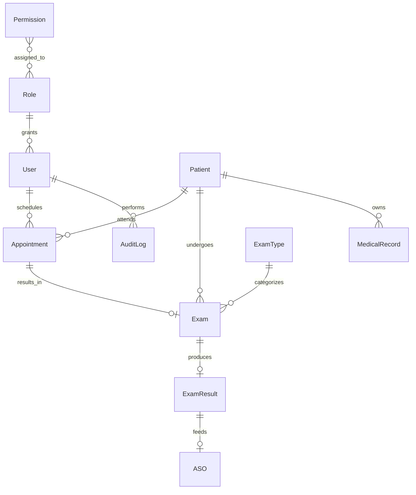

# Database

> ⚠️ **Esta é uma modelagem proposta** para a Etapa 3. O esquema atual não
> persiste dados (MSW em memória).

A plataforma **Falcão Saúde Ocupacional** será suportada por um banco
**PostgreSQL 16+** com **Prisma ORM** no backend. Este documento descreve o
**modelo relacional proposto**, índices e considerações LGPD.

## Diagrama de alto nível



## Entidades principais

### `User` (usuários do sistema)

| Campo | Tipo | Notas |
|---|---|---|
| `id` | UUID PK | |
| `email` | CITEXT UNIQUE | case-insensitive |
| `name` | VARCHAR(120) | |
| `passwordHash` | TEXT | bcrypt cost 12 |
| `roleId` | UUID FK → `Role.id` | |
| `isActive` | BOOLEAN | default true |
| `lastLoginAt` | TIMESTAMPTZ | nullable |
| `createdAt` | TIMESTAMPTZ | default now() |
| `updatedAt` | TIMESTAMPTZ | auto |

### `Role` (papéis RBAC)

| Campo | Tipo | Notas |
|---|---|---|
| `id` | UUID PK | |
| `name` | TEXT UNIQUE | `admin`, `doctor`, `nurse`, `reception`, `hr`, `tech` |
| `label` | VARCHAR(80) | rótulo exibido |
| `permissions` | UUID[] FK → `Permission.id` | via tabela `RolePermission` |

### `Permission`

| Campo | Tipo | Notas |
|---|---|---|
| `id` | UUID PK | |
| `code` | TEXT UNIQUE | `appointment.create`, `exam.sign`, etc. |
| `description` | TEXT | |

### `Patient` (pacientes / trabalhadores)

| Campo | Tipo | Notas |
|---|---|---|
| `id` | UUID PK | |
| `cpf` | CHAR(11) UNIQUE | validado, sem máscara |
| `name` | VARCHAR(200) | |
| `birthDate` | DATE | |
| `gender` | ENUM | `M`, `F`, `OTHER` |
| `phone` | VARCHAR(20) | |
| `email` | VARCHAR(120) | nullable |
| `address` | JSONB | logradouro, número, cidade, UF, CEP |
| `companyId` | UUID FK → `Company.id` | empregador atual |
| `createdAt` | TIMESTAMPTZ | |
| `deletedAt` | TIMESTAMPTZ | soft delete (LGPD) |

### `Company` (empresa cliente)

| Campo | Tipo | Notas |
|---|---|---|
| `id` | UUID PK | |
| `cnpj` | CHAR(14) UNIQUE | |
| `name` | VARCHAR(200) | |
| `address` | JSONB | |
| `isActive` | BOOLEAN | |

### `Appointment` (agendamento)

| Campo | Tipo | Notas |
|---|---|---|
| `id` | UUID PK | |
| `patientId` | UUID FK | |
| `doctorId` | UUID FK → `User.id` | nullable (pode ser pré-triagem) |
| `type` | ENUM | `ADMISSION`, `PERIODIC`, `RETURN`, `DEMISSIONAL` |
| `scheduledAt` | TIMESTAMPTZ | |
| `durationMin` | INT | default 30 |
| `status` | ENUM | `SCHEDULED`, `CONFIRMED`, `IN_PROGRESS`, `DONE`, `CANCELED`, `NO_SHOW` |
| `notes` | TEXT | |
| `createdById` | UUID FK → `User.id` | |
| `createdAt` | TIMESTAMPTZ | |
| `updatedAt` | TIMESTAMPTZ | |

### `Exam` (exame clínico)

| Campo | Tipo | Notas |
|---|---|---|
| `id` | UUID PK | |
| `patientId` | UUID FK | |
| `examTypeId` | UUID FK | |
| `appointmentId` | UUID FK | nullable |
| `requestedAt` | TIMESTAMPTZ | |
| `performedAt` | TIMESTAMPTZ | nullable |
| `status` | ENUM | `REQUESTED`, `IN_PROGRESS`, `DONE`, `CANCELED` |
| `attachments` | JSONB | URLs S3, hash, mime |

### `ExamType` (tipo de exame)

| Campo | Tipo | Notas |
|---|---|---|
| `id` | UUID PK | |
| `code` | TEXT UNIQUE | `AUDIOMETRY`, `SPIROMETRY`, ... |
| `name` | VARCHAR(120) | |
| `description` | TEXT | |
| `defaultDurationMin` | INT | |

### `ExamResult` (laudo)

| Campo | Tipo | Notas |
|---|---|---|
| `id` | UUID PK | |
| `examId` | UUID FK UNIQUE | 1:1 |
| `content` | JSONB | estruturado por tipo |
| `summary` | TEXT | texto livre |
| `signedById` | UUID FK → `User.id` | médico responsável |
| `signedAt` | TIMESTAMPTZ | |
| `signature` | TEXT | hash do documento + timestamp |

### `ASO` (Atestado de Saúde Ocupacional)

| Campo | Tipo | Notas |
|---|---|---|
| `id` | UUID PK | |
| `patientId` | UUID FK | |
| `appointmentId` | UUID FK | |
| `result` | ENUM | `FIT`, `UNFIT`, `RESTRICTED` |
| `restrictions` | TEXT | nullable |
| `validUntil` | DATE | |
| `issuedAt` | TIMESTAMPTZ | |
| `signedById` | UUID FK → `User.id` | |
| `pdfUrl` | TEXT | URL no S3 |

### `MedicalRecord` (prontuário)

| Campo | Tipo | Notas |
|---|---|---|
| `id` | UUID PK | |
| `patientId` | UUID FK | |
| `entries` | JSONB | timeline: {date, type, content, authorId} |
| `updatedAt` | TIMESTAMPTZ | |

### `AuditLog` (auditoria LGPD)

| Campo | Tipo | Notas |
|---|---|---|
| `id` | UUID PK | |
| `userId` | UUID FK | quem fez |
| `action` | TEXT | `READ`, `CREATE`, `UPDATE`, `DELETE`, `EXPORT` |
| `resource` | TEXT | `Patient`, `Exam`, ... |
| `resourceId` | UUID | |
| `ip` | INET | |
| `userAgent` | TEXT | |
| `occurredAt` | TIMESTAMPTZ | default now() |
| `metadata` | JSONB | diffs (sem PII) |

## Índices críticos

```sql
CREATE INDEX idx_appointment_scheduled_at ON appointment (scheduled_at);
CREATE INDEX idx_appointment_doctor_date ON appointment (doctor_id, scheduled_at);
CREATE INDEX idx_exam_patient_status ON exam (patient_id, status);
CREATE INDEX idx_patient_cpf ON patient (cpf);
CREATE INDEX idx_audit_user_time ON audit_log (user_id, occurred_at DESC);
CREATE INDEX idx_audit_resource ON audit_log (resource, resource_id);
```

## LGPD

- **Criptografia em repouso**: pgcrypto + KMS (AWS KMS / GCP KMS).
- **Criptografia em trânsito**: TLS 1.3.
- **Soft delete**: `deletedAt` em `Patient`; **anonimização** após 5 anos.
- **Right to be forgotten**: job batch (semanal) que substitui PII por hash
  irreversível após solicitação.
- **Auditoria**: 100% de leituras de prontuário registradas.
- **Consentimento**: tabela `Consent` com `acceptedTerms`, `version`,
  `ip`, `timestamp`.
- **Exportação de dados**: endpoint `/api/me/export` retorna JSON completo
  do titular.

## Backup e DR

- **Backup diário** automatizado (pg_dump + WAL archiving).
- **RPO**: 1 hora. **RTO**: 4 horas.
- **Read replica** em região secundária (Etapa 7).

## Próximas etapas

- [ ] Definir migrations iniciais (Prisma).
- [ ] Seeds para desenvolvimento.
- [ ] Triggers de auditoria (gen_random_uuid + audit).
- [ ] Testes de carga (k6 ou pgbench).
